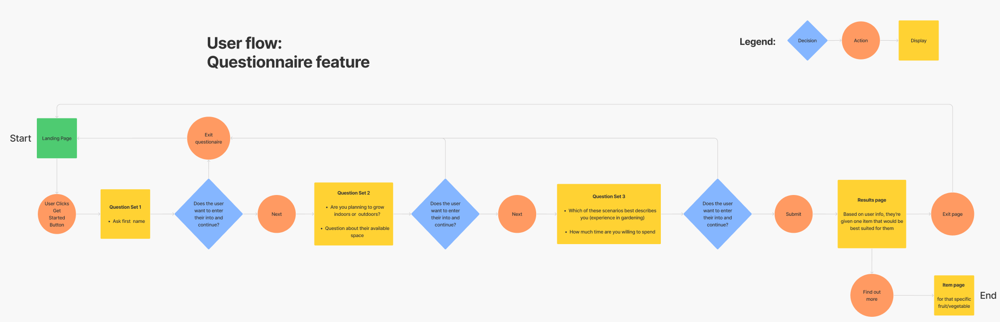
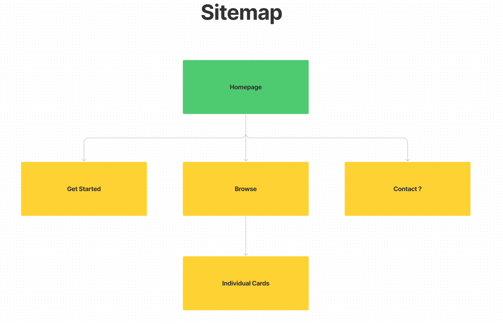
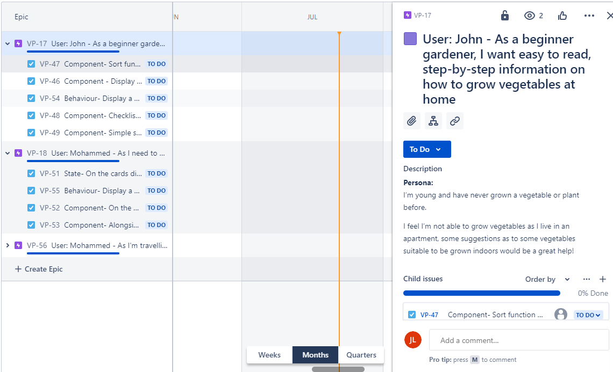
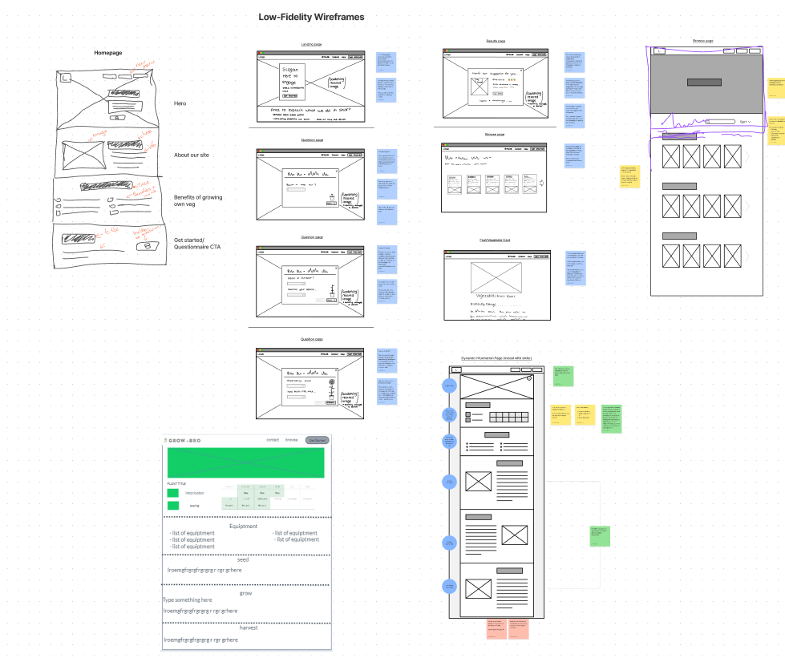
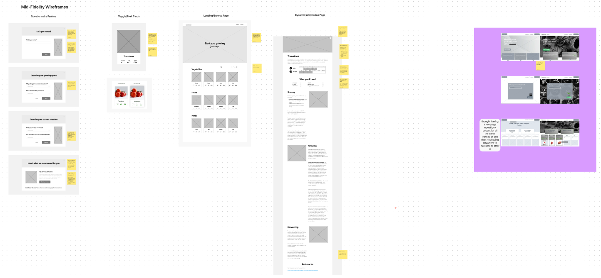
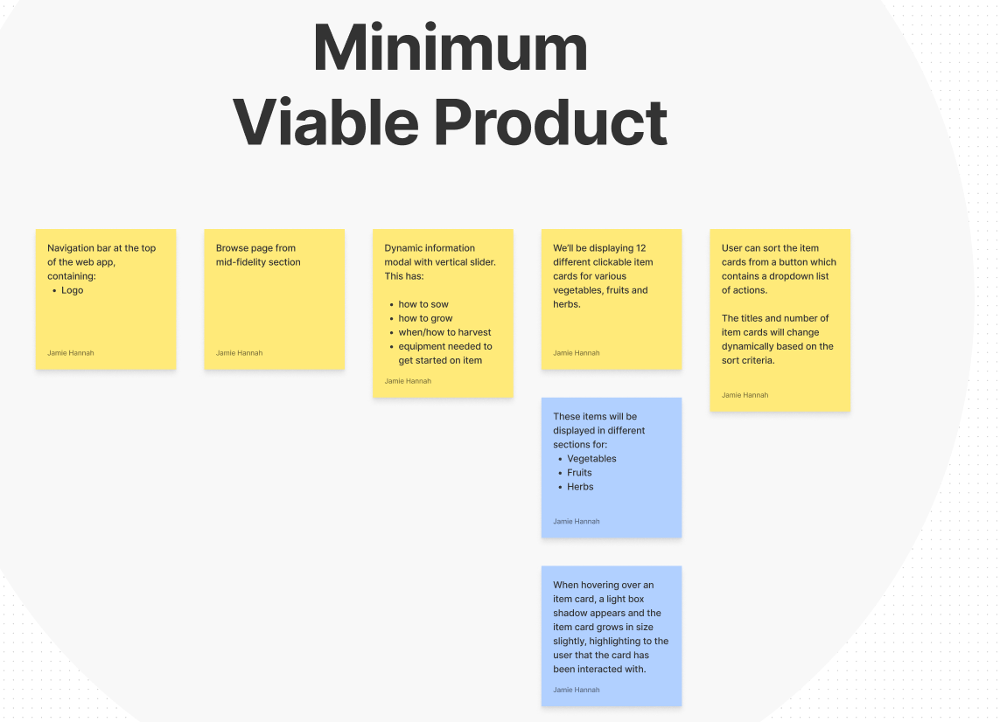
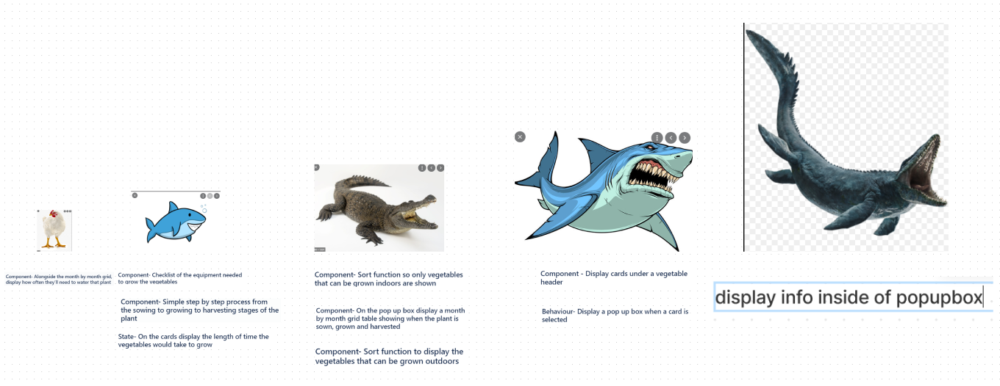
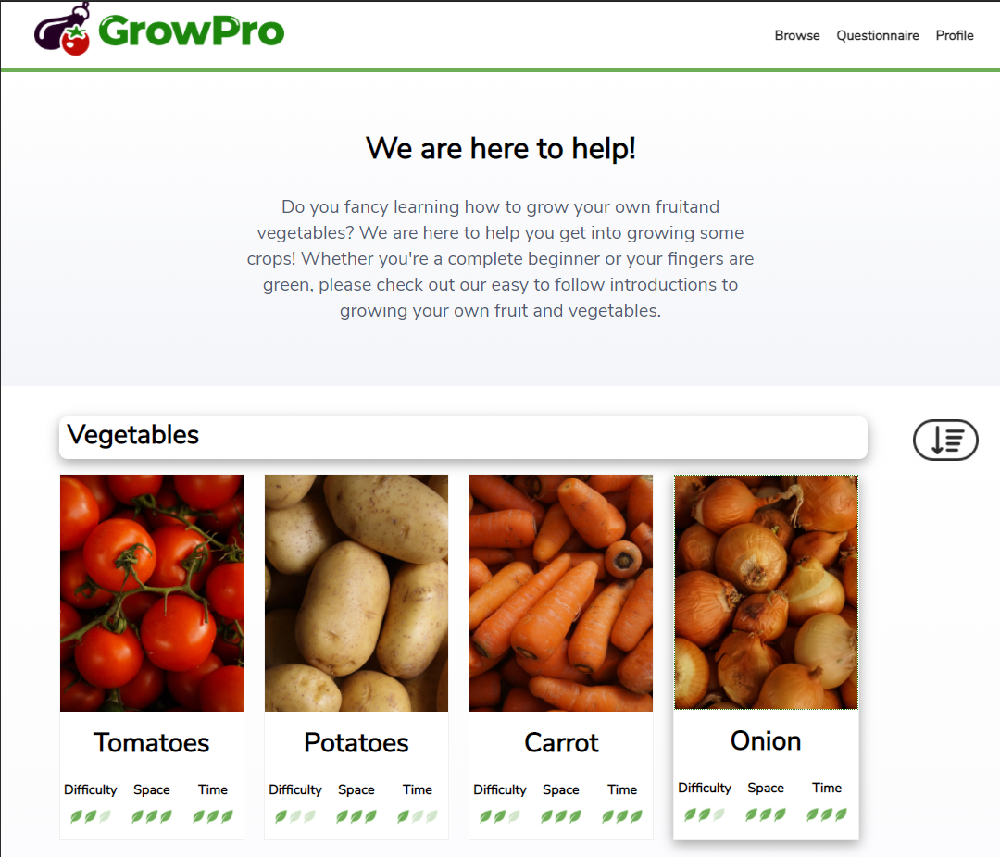

# Team Gro Pro

Team Gro Pro's main aim is to help push the groth and accesibilty of growing Fruit, Vegetables and Herbs at home during the pandemic

---

## Authors 
* Jordan Linton
* Jamie Hannah
* Jack Brown
* Yonis Elmi

---
## Guide:   

We started with our User Experience by getting a users needs,wants,problems and fustrations with a simple google forms questionaire that then lead us to our Flow and SiteMap
## Flow

## Site Map
---

   

We then begain to build the low fedelity wireframes taking carefull consideration as to what our user needed from the site
with __Stories__
## User stories

After a long and arduous User Experience we then began to build our low fedilty wire frames keeping our own need's third to the teams needs and teams needs secound to the customers...

Ew!..🤢   
To then make our Mid Fidelity   
Ahh!...😍

And finally our high Fidelity

We then begain the strenuous process of breaking down our M.V.P "Minimum Viable Product which we cut out the unneeded content to give the user exactly what they needed which we then added onto at each point.

## Next was our task allassian problem break down handing each task using tickets chosen

